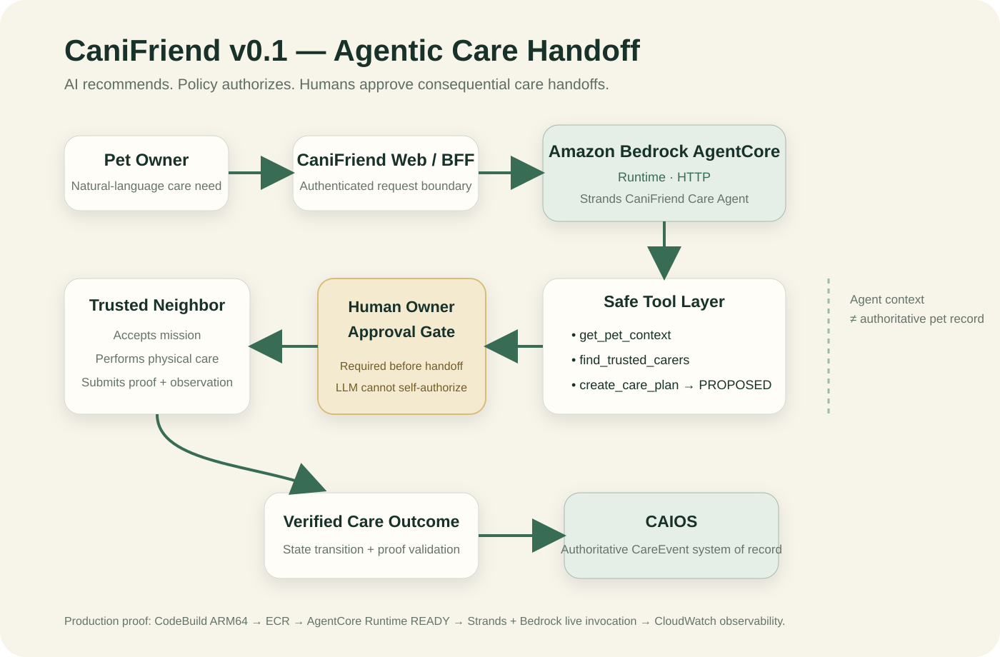

# CaniFriend

**When you can't be there, your neighborhood can.**

CaniFriend is an AI-coordinated trusted-neighborhood care network for pets, built for the **Good Neighbor Agents** track of Agents for Humans.

## The 90-second story

A pet owner says:

> “I can't get home tonight. Make sure Pika gets dinner.”

CaniFriend retrieves Pika's minimum-necessary care context, finds an already-trusted and authorized neighbor, proposes a care plan, pauses for owner approval, coordinates the care mission, captures proof and an observation, and records the verified outcome back into the pet's longitudinal record.

## Why this is agentic

This is not a chatbot answer. The **Strands Agents SDK** agent performs real orchestration:

1. understand the care need,
2. retrieve pet context,
3. find eligible trusted carers,
4. propose the best care plan,
5. stop at a human approval boundary.

Consequential actions are intentionally outside the LLM's autonomous toolset. The owner approves. The carer accepts and completes. The system validates transitions and records the final outcome.

## Architecture



```text
CaniFriend Web
    |
    | POST /invocations
    v
Amazon Bedrock AgentCore Runtime (HTTP)
    |
    v
Strands Care Agent
    |
    +--> get_pet_context ------> bounded pet context
    +--> find_trusted_carers --> synthetic trust graph
    +--> create_care_plan -----> PROPOSED
                                  |
                                  v
                           OWNER APPROVAL
                                  |
                                  v
                         carer accept / care
                                  |
                                  v
                         proof + care outcome
```

See `docs/ARCHITECTURE.md` for the trust and memory boundaries.

## Safety rule

> AI recommends. Policy authorizes. Humans approve consequential care handoffs.

The model cannot approve a care plan, accept on behalf of a carer, complete a care task, or write the final authoritative care outcome by itself.

## Quick start

### Prerequisites

- Python 3.11+ recommended
- `pip`
- Optional for live Strands/Bedrock mode: an AWS account/role authorized to invoke the selected Amazon Bedrock model in the configured region
- No production CAIOS credentials or private pet data are required for the deterministic demo and tests

### 1. Clone and create an environment

```bash
git clone https://github.com/corwinlim/CaniFriend-v0.1.git
cd CaniFriend-v0.1
python -m venv .venv
```

Activate it:

```bash
# macOS / Linux
source .venv/bin/activate

# Windows PowerShell
.\.venv\Scripts\Activate.ps1
```

### 2. Install dependencies

```bash
python -m pip install --upgrade pip
pip install -r agent/requirements.txt
```

### 3. Run the deterministic judge path locally

The deterministic path uses the repository's synthetic Pika/neighbor fixtures and does not call Bedrock:

```bash
CANIFRIEND_AGENT_MODE=deterministic python - <<'PY'
from agent.agentcore_app import handle_payload
print(handle_payload({
    "action": "agent",
    "pet_id": "pika",
    "prompt": "I can't get home tonight. Make sure Pika gets dinner."
}))
PY
```

On Windows PowerShell:

```powershell
$env:CANIFRIEND_AGENT_MODE="deterministic"
python -c "from agent.agentcore_app import handle_payload; print(handle_payload({'action':'agent','pet_id':'pika','prompt':\"I can't get home tonight. Make sure Pika gets dinner.\"}))"
```

The expected safety property is a **PROPOSED** care plan with owner approval still required. The agent must not self-authorize the handoff.

### 4. Run tests

```bash
pytest -q
```

The tests cover care-flow state transitions, demo/runtime contracts, and AWS access-proof handling. A local test run is the source of truth for your environment; committed proof documents describe the hackathon verification runs.

### 5. Open the judge UI

The lightweight judge UI is in `web/`. From the repository root:

```bash
python -m http.server 8080 -d web
```

Then open `http://localhost:8080/demo.html`.

The golden path is:

```text
Pika needs dinner
→ retrieve bounded context
→ select trusted Neighbor A
→ OWNER APPROVAL REQUIRED
→ owner approves
→ neighbor accepts and completes care
→ proof / observation
→ verified care outcome
```

### 6. Optional: run the live Strands + Amazon Bedrock path

Use AWS credentials through the normal AWS credential provider chain. **Do not commit credentials to this repository.**

```bash
export AWS_REGION=us-west-2
export CANIFRIEND_MODEL_ID=amazon.nova-lite-v1:0
export CANIFRIEND_AGENT_MODE=strands
python agent/agentcore_app.py
```

PowerShell equivalents:

```powershell
$env:AWS_REGION="us-west-2"
$env:CANIFRIEND_MODEL_ID="amazon.nova-lite-v1:0"
$env:CANIFRIEND_AGENT_MODE="strands"
python agent/agentcore_app.py
```

`agent/agentcore_app.py` is the Amazon Bedrock AgentCore runtime entrypoint. Deployment details can vary by AWS account and AgentCore tooling version, so this repository does not hard-code account IDs, role ARNs, registry URLs, credentials, or private deployment identifiers. See `docs/DEPLOYMENT-CHECKLIST.md` and the AWS proof documents for the architecture and verification boundary.

## Configuration

| Variable | Required | Default | Purpose |
| --- | --- | --- | --- |
| `CANIFRIEND_AGENT_MODE` | No | `strands` | `deterministic` for the reproducible synthetic judge path; `strands` for the live LLM path |
| `AWS_REGION` | Live mode only | `us-west-2` | AWS/Bedrock region |
| `CANIFRIEND_MODEL_ID` | No | `amazon.nova-lite-v1:0` | Bedrock model used by the Strands agent |

No `.env` file is required for the deterministic demo.

## Production proof

The hackathon build has been verified through AWS CodeBuild → ECR → Amazon Bedrock AgentCore Runtime → Strands Agents SDK → Amazon Bedrock. The recorded judge-path invocation selected Neighbor A, preserved Pika's dinner context, and returned an owner-approval requirement.

See `docs/LIVE-PROOF.md`, `docs/OBSERVABILITY-PROOF.md`, `docs/TEST-PROOF.md`, and `docs/DEMO-SCREENPLAY.md`.

## Synthetic-data and privacy disclosure

The public hackathon build uses synthetic/demo data for Pika, trusted neighbors, permissions, care plans, observations, and outcomes. It is not a veterinary diagnostic system and must not be used as a substitute for veterinary care.

Do not place real owner records, veterinary records, production database exports, access tokens, AWS credentials, private endpoints, or other sensitive information in this repository.

## Prior work and Background IP

CaniFriend is a hackathon integration/prototype built on ideas and product work that pre-date this hackathon, including CAIOS companion-context concepts. The hackathon-specific implementation demonstrates the CaniFriend agent workflow, Strands/AgentCore integration, bounded context handoff, human approval gate, deterministic care-state transitions, synthetic judge experience, and verification artifacts.

This repository intentionally **does not include** CAIOS production Background IP such as the production longitudinal Memory Engine, retrieval/ranking/scoring systems, private recommendation or clinical/nutrition graphs, proprietary prompts/evidence corpora, production decision policies, real customer/veterinary/CRM data, or production credentials and infrastructure secrets.

References to CAIOS in the demo describe an integration/system-of-record boundary; they do not imply that the private CAIOS production implementation is open-sourced here.

## Repository map

```text
agent/      Strands agent, deterministic actions, audit, API adapters
web/        judge UI and live/fallback API client
shared/     stable data contracts
tests/      safety, runtime, state-transition, and web-contract tests
docs/       architecture, demo, observability, deployment, video, submission
infra/      AgentCore verification/deployment helpers
```

## Reproducing the judge scenario

1. Start with deterministic mode and the synthetic Pika fixture.
2. Request dinner coverage.
3. Verify Neighbor A is selected from authorized candidates rather than invented by the model.
4. Verify the plan remains `PROPOSED` until a separate owner approval action occurs.
5. Verify the carer must separately accept and complete the mission.
6. Verify completion requires proof before the outcome is treated as completed/recordable.

This separation is intentional: **model reasoning is not authorization**.

## License

MIT. See `LICENSE`.
